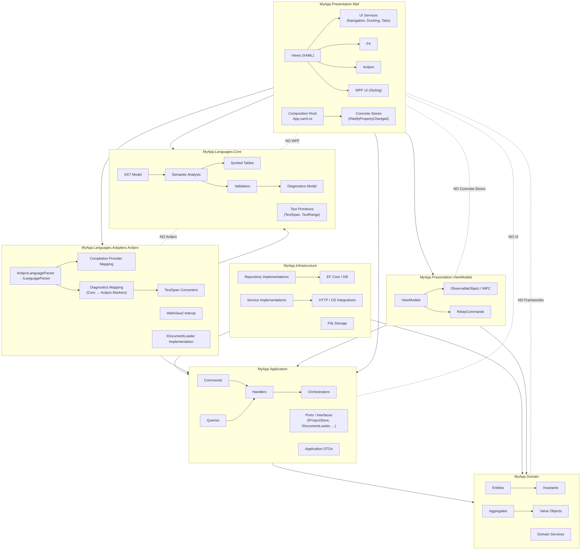

# Blueprint – Clean Architecture + DDD + Language Platform

This project follows Clean Architecture, DDD principles, and strict separation of concerns.

It is designed to support:

- A rich WPF desktop application
- A custom language platform (AST, semantic analysis, diagnostics)
- Multiple editor technologies (Actipro)
- Modern UI styling via WPF UI
- Vendor isolation through adapters

The goal is long-term maintainability, vendor independence, and clean boundaries.


# 🧱 Architecture Overview

```
Solution
│
├─ MyApp.Domain
│
├─ MyApp.Application
│
├─ MyApp.Languages.Core
│
├─ MyApp.Infrastructure
│
├─ MyApp.Languages.Adapters.Actipro
│
├─ MyApp.Presentation.ViewModels
│
└─ MyApp.Presentation.Wpf
```

# 🧅 Layer Responsibilities

## 1️⃣ MyApp.Domain

*Pure business logic. No frameworks. No UI. No persistence.*

Contains:

- Entities
- Value Objects
- Aggregates
- Domain services
- Invariants

🚫 Must NOT reference anything.

This is the core of your system.

## 2️⃣ MyApp.Application

*Use case orchestration layer.*

Contains:

- Commands
- Queries
- Handlers
- Orchestrators
- Ports (interfaces)
- Application models / DTOs

**Example Ports**
```csharp
public interface IRepository<T> { }
public interface IClock { }
public interface ILanguageParser { }
public interface ILanguageService { }
public interface IProjectStore { }
public interface IDocumentLoader { }
```

Application depends on:

- Domain

It does NOT depend on:

- Infrastructure
- WPF
- WPF UI
- Actipro

This is where business workflows live.

## 3️⃣ MyApp.Languages.Core

*This is your language engine.*

It is fully platform-agnostic.

Contains:

- AST model
- Semantic analysis
- Symbol tables
- Validators
- Diagnostics model
- Text primitives (TextSpan, TextRange, etc.)
- Parser logic (if independent)

🚫 Must NOT reference:

- WPF UI
- Actipro
- WPF
- Infrastructure

This allows using the language engine in:

- WPF
- Web
- CLI
- Tests
- Future platforms

This is extremely important for long-term flexibility.

## 4️⃣ MyApp.Infrastructure

*Implements application ports.*

Contains:

- EF Core / database
- File storage
- HTTP clients
- External services
- OS integrations

Implements:

- Repositories
- File store
- Clock
- Other external ports

Depends on:

- Application
- Domain

🚫 Does NOT depend on:

- Presentation
- Actipro

## 5️⃣ MyApp.Languages.Adapters.Actipro

*Actipro-specific adapter.*

Purpose: Bridge Actipro editor to your core language engine.

Contains:

- ActiproLanguageParser : ILanguageParser
- Diagnostic mapping (Core → Actipro markers)
- Completion provider mapping
- Actipro ↔ TextSpan converters
- WebView2 interop layer
- IDocumentLoader implementation (Actipro-specific)

Depends on:

- Actipro integration
- MyApp.Languages.Core
- MyApp.Application (interfaces only)

This keeps Actipro isolated and replaceable.
If one day you swap editors, only this project changes.

## 6️⃣ MyApp.Presentation.ViewModels

*ViewModel layer — UI-aware but store-blind.*

Contains:

- All ViewModels
- ObservableObject / INotifyPropertyChanged base classes
- RelayCommands
- ObservableCollections (for display state owned by the VM)

Depends on:

- MyApp.Application (use cases and store interfaces/ports)
- MyApp.Domain (read models, value objects)
- WPF binding infrastructure (INPC, commands)

🚫 Must NOT reference:

- MyApp.Presentation.Wpf
- Concrete Store implementations
- Actipro

**Why this assembly exists:**

ViewModels may only interact with Stores through the interfaces defined in the Application layer (`IProjectStore`, `IProjectStoreReader`, etc.). Because the concrete Store implementations live in `MyApp.Presentation.Wpf`, which this assembly does not reference, it is **structurally impossible** for a ViewModel to bypass Application services and mutate a Store directly. The compiler enforces this — no discipline required.

## 7️⃣ MyApp.Presentation.Wpf

*Composition and rendering layer.*

Built with:

- WPF
- WPF UI
- Actipro

Contains:

- Views (XAML)
- Concrete Store implementations (INotifyPropertyChanged, ObservableCollection)
- Composition Root (App.xaml.cs) — the only place that knows about everything
- UI Services (Navigation, Docking, Tabs, Window management)

**This is the only place that touches concrete Stores.**
DI wires the concrete stores to the Application interfaces at startup.
Nothing outside this assembly can resolve the concrete store types.

## 💥 Important Rules

ViewModels depend on:

- Application (use cases + store interfaces)
- Domain (value objects, read models)

ViewModels do NOT depend on:

- Concrete Stores
- Actipro

Views depend on:

- ViewModels only
- No business logic in Views




---

## 🔒 Store Boundary Pattern

Stores hold shared observable UI state (open files, current project, etc.). They are the UI's equivalent of Infrastructure — they implement Application ports, but live in the Presentation layer.

### Why the Split Matters

Without the assembly split, a ViewModel could bypass `ProjectService` and mutate the store directly:

```csharp
// ❌ Possible without the split — ViewModel reaching into the store
_projectStore.OpenFiles.Add(file);
```

With the split, `MyApp.Presentation.ViewModels` does not reference `MyApp.Presentation.Wpf`, so the concrete `ProjectStore` type is simply invisible. The ViewModel can only interact through the Application interface:

```csharp
// ✅ The only path available to a ViewModel
await _projectService.OpenProjectAsync(path);
```

### Store Interface (Application layer)

```csharp
// MyApp.Application — defines the contract
public interface IProjectStore
{
    IReadOnlyList<ProjectFile> OpenFiles { get; }
    Project? CurrentProject { get; }
    void AddFile(ProjectFile file);
    void RemoveFile(string path);
    void SetCurrentProject(Project? project);
}

// Optional read-only view for VMs that only display state
public interface IProjectStoreReader
{
    IReadOnlyList<ProjectFile> OpenFiles { get; }
    Project? CurrentProject { get; }
}
```

### Store Implementation (Presentation.Wpf)

```csharp
// MyApp.Presentation.Wpf — UI-aware, invisible to ViewModels
public class ProjectStore : ObservableObject, IProjectStore
{
    private readonly ObservableCollection<ProjectFile> _openFiles = new();
    private Project? _currentProject;

    public IReadOnlyList<ProjectFile> OpenFiles => _openFiles;
    public Project? CurrentProject => _currentProject;

    public void AddFile(ProjectFile file) => _openFiles.Add(file);
    public void RemoveFile(string path) =>
        _openFiles.Remove(_openFiles.First(f => f.Path == path));

    public void SetCurrentProject(Project? project)
    {
        _currentProject = project;
        OnPropertyChanged();
    }
}
```

### Application Service (Application layer)

```csharp
// MyApp.Application — orchestrates the use case
public class ProjectService
{
    private readonly IProjectStore _store;
    private readonly IDocumentLoader _loader;

    public ProjectService(IProjectStore store, IDocumentLoader loader)
    {
        _store = store;
        _loader = loader;
    }

    public async Task OpenProjectAsync(string projectPath)
    {
        var project = Project.Load(projectPath);
        _store.SetCurrentProject(project);

        foreach (var file in project.Files)
            await _loader.LoadDocumentAsync(file.Path);
    }

    public Task CloseProjectAsync()
    {
        foreach (var file in _store.OpenFiles.ToList())
            _store.RemoveFile(file.Path);

        _store.SetCurrentProject(null);
        return Task.CompletedTask;
    }
}
```

### Document Loader Port (Application layer)

```csharp
// MyApp.Application — editor-agnostic port
public interface IDocumentLoader
{
    Task LoadDocumentAsync(string path);
    Task CloseDocumentAsync(string path);
}

// MyApp.Languages.Adapters.Actipro — Actipro implementation
public class ActiproDocumentLoader : IDocumentLoader
{
    public Task LoadDocumentAsync(string path) { /* Actipro-specific */ }
    public Task CloseDocumentAsync(string path) { /* Actipro-specific */ }
}
```

---

## 🖥 Editor Architecture (Actipro)

Why Actipro?

- Modern editor experience
- Rich IntelliSense model

Integration Strategy Flow:

- User edits text
- Text is sent to Core language engine
- AST + semantic analysis run
- Diagnostics returned
- Adapter converts diagnostics → Actipro markers
- Actipro renders errors/warnings

Completion flow:

- Actipro triggers completion event
- Adapter maps position → TextSpan
- Core engine returns suggestions
- Adapter maps to Actipro completion items

---

## 🧼 Clean Architecture Principles Enforced

- Domain is pure.
- Application orchestrates.
- Infrastructure implements.
- Actipro is isolated behind adapter.
- Stores are hidden behind Application interfaces.
- ViewModels cannot bypass use cases — enforced by assembly boundaries.
- UI can be replaced.
- Language engine is reusable.

## 🎯 Design Goals

This structure allows:

- Vendor independence
- Clean DDD boundaries
- Testable language engine
- Replaceable UI/editor
- Scalable architecture
- Long-term product evolution

## 🚀 Long-Term Vision

Because the language engine is isolated, it can power:

- A Web IDE
- A CLI compiler
- A Cloud LSP service
- A future MAUI or web front-end

The WPF UI is just one presentation layer.

## 📝 Summary

The solution is structured to ensure:
- ✔ Clean separation of concerns
- ✔ Explicit dependency direction
- ✔ Vendor isolation (Actipro)
- ✔ Reusable language engine
- ✔ Store mutations enforced through Application services (compiler-enforced, not convention)
- ✔ Long-term maintainability

---

## 🧭 Page & Navigation Strategy

### 🖥 Top-Level Modes

In Blueprint, `Page` is used exclusively for large application modes.

Examples:

- CodingPage
- DatabasePage
- SettingsPage

Each Page represents a major functional context of the application, not a workflow step.

## 📦 Page Lifetime Policy

Blueprint intentionally relies on the default behavior of WPF UI navigation, where:

- Pages are created once
- Pages are cached
- Pages behave effectively as singletons within the application lifetime

This behavior is intentional and aligned with the design.

Pages are considered:

- Long-lived
- State-preserving
- Mode containers

This avoids unnecessary recreation and preserves internal UI state (tabs, selections, layout, etc.).

## 🧠 What Lives Inside a Page?

Each Page acts as a mode container.

Coding Mode example:

- TabControl for open files
- Actipro editor host
- TreeView for file system navigation
- Tool panels (errors, output, etc.)

Database Mode example:

- TabControl for queries
- Results grid
- Connection explorer

Settings Mode example:

- Configuration panels
- No tab system required

The Page itself provides structure. All dynamic content is composed using UserControls.

## 🧩 UserControls for Everything Else

All secondary UI components must be implemented as UserControls:

- Dockable panels
- Editor views
- Tool windows
- Settings panels
- Tree components
- Grids
- Forms

UserControls:

- Do NOT use navigation
- Do NOT rely on Page lifetime
- Are composed inside Pages
- Can be created and destroyed freely

## 🚫 What Pages Are NOT Used For

Pages are NOT:

- Workflow screens
- Temporary views
- Dialog-style navigation targets
- Recreated per action

Transient UI flows should be:

- UserControls
- Dialogs
- Dockable views
- ViewModel-driven state changes