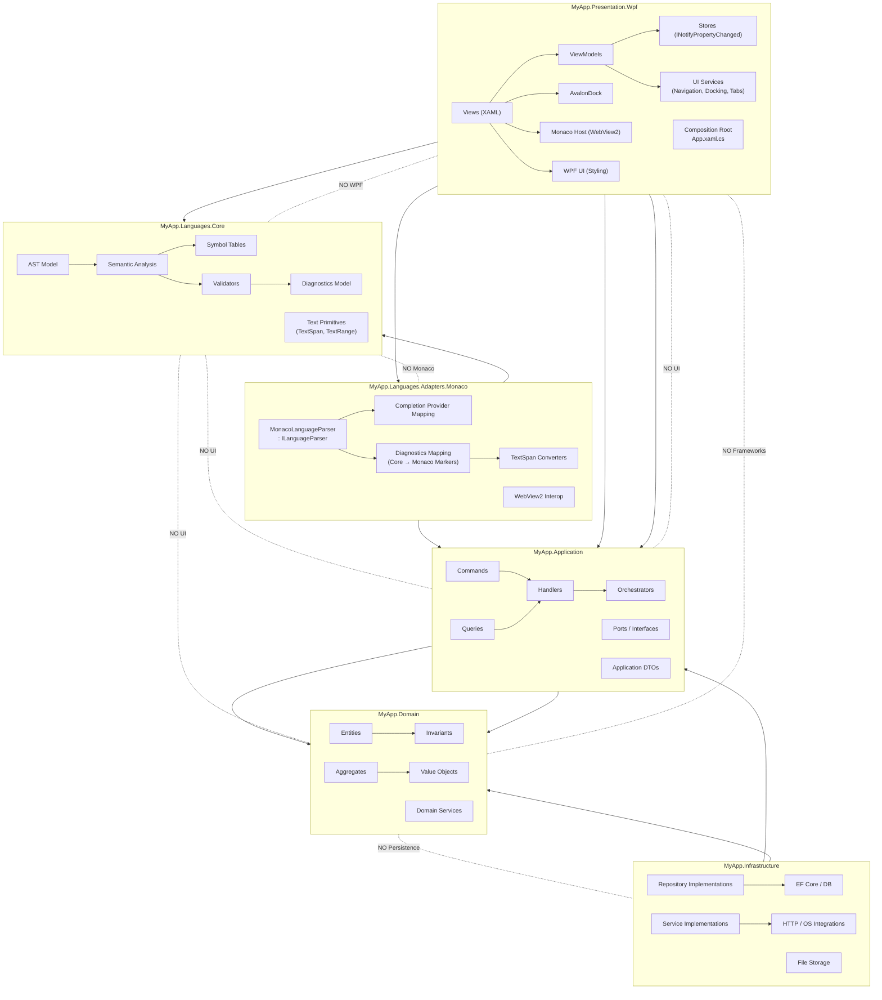

# Blueprint – Clean Architecture + DDD + Language Platform

This project follows Clean Architecture, DDD principles, and strict separation of concerns.

- It is designed to support:

- A rich WPF desktop application

- A custom language platform (AST, semantic analysis, diagnostics)

- Multiple editor technologies (Monaco, Actipro)

- Docking system via AvalonDock

- Modern UI styling via WPF UI

- Vendor isolation through adapters


The goal is long-term maintainability, vendor independence, and clean boundaries.


# 🧱 Architecture Overview

```Solution
│
├─ MyApp.Domain
│
├─ MyApp.Application
│
├─ MyApp.Languages.Core
│
├─ MyApp.Infrastructure
│
├─ MyApp.Languages.Adapters.Actipro
│
├─ MyApp.Languages.Adapters.Monaco
│
└─ MyApp.Presentation.Wpf
```

# 🧅 Layer Responsibilities

## 1️⃣ MyApp.Domain

*Pure business logic. No frameworks. No UI. No persistence.*

Contains:

- Entities

- Value Objects

- Aggregates

- Domain services

- Invariants

🚫 Must NOT reference Anything:


This is the core of your system.

## 2️⃣ MyApp.Application

*Use case orchestration layer.*

Contains:

- Commands

- Queries

- Handlers

- Orchestrators

- Ports (interfaces)

- Application models / DTOs


**Example Ports**
``` csharp
public interface IRepository<T> { }
public interface IClock { }
public interface ILanguageParser { }
public interface ILanguageService { }
```

Application depends on:

- Domain

It does NOT depend on:

- Infrastructure

- WPF

- WPF UI

- Monaco

This is where business workflows live.

## 3️⃣ MyApp.Languages.Core

*This is your language engine.*

It is fully platform-agnostic.

Contains:

- AST model

- Semantic analysis

- Symbol tables

- Validators

- Diagnostics model

- Text primitives (TextSpan, TextRange, etc.)

- Parser logic (if independent)

🚫 Must NOT reference:

- WPF UI

- Monaco

- WPF

- Infrastructure

This allows:

Using the language engine in:

- WPF

- Web

- CLI

- Tests

Future platforms

This is extremely important for long-term flexibility.

## 4️⃣ MyApp.Infrastructure

*Implements application ports.*

Contains:

- EF Core / database

- File storage

- HTTP clients

- External services

- OS integrations

Implements:

- Repositories

- File store

- Clock

- Other external ports

Depends on:

- Application

- Domain

🚫 Does NOT depend on:

- Presentation

- Actipro

- Monaco


## 5️⃣ MyApp.Languages.Adapters.Monaco

*Monaco-specific adapter.*

Purpose:

Bridge Monaco editor to your core language engine.

Contains:

- MonacoLanguageParser : ILanguageParser

- Diagnostic mapping (Core → Monaco markers)

- Completion provider mapping

- Monaco ↔ TextSpan converters

- WebView2 interop layer

Depends on:

- Monaco integration

- MyApp.Languages.Core

- MyApp.Application (interfaces only)

This keeps Monaco isolated and replaceable.

If one day you swap editors, only this project changes.

## 6️⃣ MyApp.Presentation.Wpf

*UI Layer.*

Built with:

- WPF

- WPF UI

- AvalonDock

- Monaco (WebView2 host)

Contains:

- Views (XAML)

- ViewModels

- Stores (shared INPC state)

UI services:

- Navigation

- Docking

- Tabs

- Window management

- Composition root (App.xaml.cs)

## 💥 Important Rule

ViewModels depend on:

- Application

- Languages.Core (if necessary)

Views depend on:

- UI frameworks only

- No business logic in Views.




---

## 🖥 Editor Architecture (Monaco)
Why Monaco?

- Modern editor experience

- Rich IntelliSense model

- Web-based flexibility

- Future cloud compatibility

- Integration Strategy

Monaco runs inside:

- WebView2

Flow:

- User edits text

- Text is sent to Core language engine

- AST + semantic analysis run

- Diagnostics returned

- Adapter converts diagnostics → Monaco markers

- Monaco renders errors/warnings

Completion flow:

- Monaco triggers completion event

- Adapter maps position → TextSpan

- Core engine returns suggestions

- Adapter maps to Monaco completion items


## 🧼 Clean Architecture Principles Enforced

Domain is pure.

Application orchestrates.

Infrastructure implements.

Monaco is isolated behind adapter.

UI can be replaced.

Language engine is reusable.

## 🎯 Design Goals
This structure allows:

Vendor independence

Clean DDD boundaries

Testable language engine

Replaceable UI/editor

Scalable architecture

Long-term product evolution

## 🚀 Long-Term Vision
Because the language engine is isolated:

It can power:

A Web IDE

A CLI compiler

A Cloud LSP service

A future MAUI or web front-end

The WPF UI is just one presentation layer.

## 📝 Summary

The solution is structured to ensure:
- ✔ Clean separation of concerns
- ✔ Explicit dependency direction
- ✔ Vendor isolation (Monaco)
- ✔ Reusable language engine
- ✔ Long-term maintainability

## 🧭 Page & Navigation Strategy
🖥 Top-Level Modes

In Blueprint, Page is used exclusively for large application modes.

Examples:

- CodingPage

- DatabasePage

- SettingsPage

Each Page represents a major functional context of the application, not a workflow step.


## 📦 Page Lifetime Policy

Blueprint intentionally relies on the default behavior of WPF UI navigation, where:

- Pages are created once

- Pages are cached

- Pages behave effectively as singletons within the application lifetime

This behavior is intentional and aligned with the design.

Pages are considered:

- Long-lived

- State-preserving

- Mode containers

- This avoids unnecessary recreation and preserves internal UI state (tabs, selections, layout, etc.).

## 🧠 What Lives Inside a Page?

Each Page acts as a mode container.

For example:

- Coding Mode

- TabControl for open files

- Monaco editor host

- TreeView for file system navigation

- Tool panels (errors, output, etc.)

## 📈 Database Mode

TabControl for queries

Results grid

Connection explorer

Settings Mode

Configuration panels

No tab system required

The Page itself provides structure.
All dynamic content is composed using UserControls.

## 🧩 UserControls for Everything Else

All secondary UI components must be implemented as:


UserControl

    Dockable panels
    Editor views
    Tool windows
    Settings panels
    Tree components
    Grids
    Forms

UserControls:

- Do NOT use navigation

- Do NOT rely on Page lifetime

- Are composed inside Pages

- Can be created and destroyed freely

### 🚫 What Pages Are NOT Used For

Pages are NOT:

- Workflow screens

- Temporary views

- Dialog-style navigation targets

- Recreated per action

- Transient UI flows should be:

- UserControls

- Dialogs

- Dockable views

- ViewModel-driven state changes